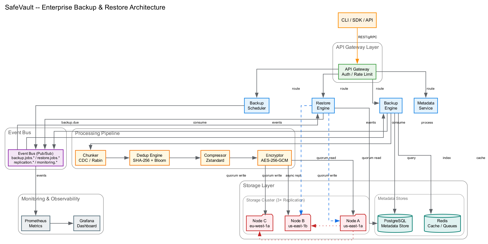

# SafeVault — Enterprise Backup & Restore System

A scalable, reliable, secure, and highly available backup and recovery platform designed to protect critical data across distributed enterprise environments. Features content-defined chunking, global deduplication, incremental backups, snapshot-based recovery, distributed replication, and event-driven architecture via Pub/Sub.

**GitHub Repository:** https://github.com/<your-username>/SafeVault *(replace with actual URL)*

---

## Project Overview

SafeVault solves the challenges of petabyte-scale backup management:
- **Slow restores** → Solved by point-in-time snapshot recovery with version chain traversal
- **Storage waste** → Solved by SHA-256 global deduplication with Bloom filter
- **Failed backups** → Solved by checkpoint-based resume and retry with exponential backoff
- **No DR capabilities** → Solved by 3× cross-region replication with quorum writes
- **No observability** → Solved by Pub/Sub event-driven monitoring and alerting

---

## Setup Instructions

### Prerequisites
- Python 3.12+
- pip (Python package installer)

### Installation

```bash
# Clone the repository
git clone https://github.com/<your-username>/SafeVault.git
cd SafeVault

# Install dependencies
pip install -r requirements.txt
```

### Dependencies

| Package | Version | Purpose |
|---------|---------|---------|
| zstandard | >=0.22.0 | Compression/decompression (zstd) |
| cryptography | >=41.0.0 | AES-256-GCM encryption |
| pytest | >=7.4.0 | Unit testing framework |
| pytest-asyncio | >=0.23.0 | Async test support |

---

## Execution Steps

### Run the Demo

```bash
python3 -m src.main
```

This executes 6 scenarios:
1. **Full Backup** — Chunks, deduplicates, compresses, encrypts, and stores files
2. **Incremental Backup** — Detects changed files via mtime/hash, backs up only new chunks
3. **Restore** — Reconstructs files from the version chain with integrity verification
4. **Monitoring** — Real-time metrics and critical alerts via Pub/Sub subscription
5. **Dedup Efficiency** — Shows dedup ratio across similar files
6. **Fault Tolerance** — Survives node failures with quorum reads

### Run Tests

```bash
python3 -m pytest tests/ -v
```

57 tests covering chunking, dedup, compression, encryption, backup/restore workflows, Pub/Sub, metadata, storage nodes, cluster replication, scheduler, and fault tolerance.

### Generate Project Documentation PDF

```bash
open docs/user_guide.md
```

---

### User Guide

For comprehensive documentation of every SafeVault feature — including installation, configuration, backup/restore operations, monitoring, dedup, fault tolerance, and the full API reference — see:

```bash
open docs/user_guide.md
```

## Project Structure

```
SafeVault/
├── docs/
│   ├── architecture.md           # HLD, Pub/Sub, component interactions
│   ├── database_schema.md        # PostgreSQL + Redis schema design (12 tables)
│   ├── algorithms.md             # CDC, dedup, incremental backup, restore algorithms
│   └── user_guide.md             # Complete feature documentation with CLI commands
├── src/
│   ├── core/
│   │   ├── chunking.py           # Rabin fingerprint CDC
│   │   ├── dedup.py              # SHA-256 dedup with Bloom filter
│   │   ├── compression.py        # Zstandard compression
│   │   └── encryption.py         # AES-256-GCM encryption
│   ├── backup/
│   │   ├── engine.py             # Full/incremental backup orchestrator
│   │   └── scheduler.py          # Cron-based scheduler
│   ├── restore/
│   │   └── engine.py             # Point-in-time restore engine
│   ├── storage/
│   │   ├── node.py               # Storage node simulation
│   │   └── cluster.py            # Distributed cluster with quorum replication
│   ├── metadata/
│   │   └── store.py              # Metadata manager (simulated PostgreSQL)
│   ├── messaging/
│   │   └── pubsub.py             # Async Pub/Sub event bus
│   ├── monitoring/
│   │   └── metrics.py            # Metrics collection and alerting
│   └── main.py                   # CLI entry point
├── tests/                        # 57 pytest tests
├── requirements.txt
├── SafeVault_Project_Documentation.pdf  # Generated project documentation PDF
└── README.md
```

---

## Key Features

| Feature | Description |
|---------|-------------|
| **Content-Defined Chunking** | Rabin fingerprint-based variable-size chunking for optimal dedup |
| **Global Deduplication** | SHA-256 hash index with Bloom filter for fast duplicate detection |
| **Incremental Backups** | Tracks changed files via mtime/hash comparison |
| **Snapshot Recovery** | Point-in-time restore via version chain traversal |
| **Replication** | 3× replication (2 in-region, 1 cross-region) with quorum writes |
| **Pub/Sub Event Bus** | Async event-driven architecture decoupling all components |
| **Fault Tolerance** | Node failure handling, retry with backoff, checkpoint resume |
| **Encryption** | AES-256-GCM per-chunk encryption |
| **Monitoring** | Real-time metrics and critical alerts via Pub/Sub subscription |

---

## Architecture Overview



The system uses an event-driven architecture with Pub/Sub at its core. All components communicate asynchronously through typed events, enabling loose coupling, resilience, and scalability.

See [`docs/architecture.md`](./docs/architecture.md) for the full architectural diagram and component descriptions.  
For a complete feature guide with all CLI commands and API references, see [`docs/user_guide.md`](./docs/user_guide.md).

---

## Additional Project Details

### Technology Stack
- **Language:** Python 3.12
- **Compression:** zstandard (zstd)
- **Encryption:** AES-256-GCM (cryptography library)
- **Hashing:** SHA-256 / SHA-512
- **Chunking:** Rabin fingerprint algorithm
- **Testing:** pytest + pytest-asyncio
- **Production reference:** PostgreSQL, Redis, Apache Kafka, Prometheus, Grafana

### Key Algorithms
- **CDC:** Rabin fingerprint rolling hash with 48-byte window, ~8KB average chunk
- **Dedup:** SHA-256 → Bloom filter → global hash index → reference counting
- **Replication:** Quorum consensus (N/2+1) for writes, any-node for reads
- **Retry:** Exponential backoff (1s base, 60s cap) with random jitter
- **Restore:** Version chain traversal (incremental → full), chunk reassembly by index

### Scalability Design
- Storage nodes scale horizontally via consistent hashing
- Metadata sharded by user_id in PostgreSQL
- Dedup index partitioned by hash prefix
- Stateless scheduler workers
- Parallel chunk processing workers

See [`docs/algorithms.md`](./docs/algorithms.md) and [`docs/database_schema.md`](./docs/database_schema.md) for complete details.
